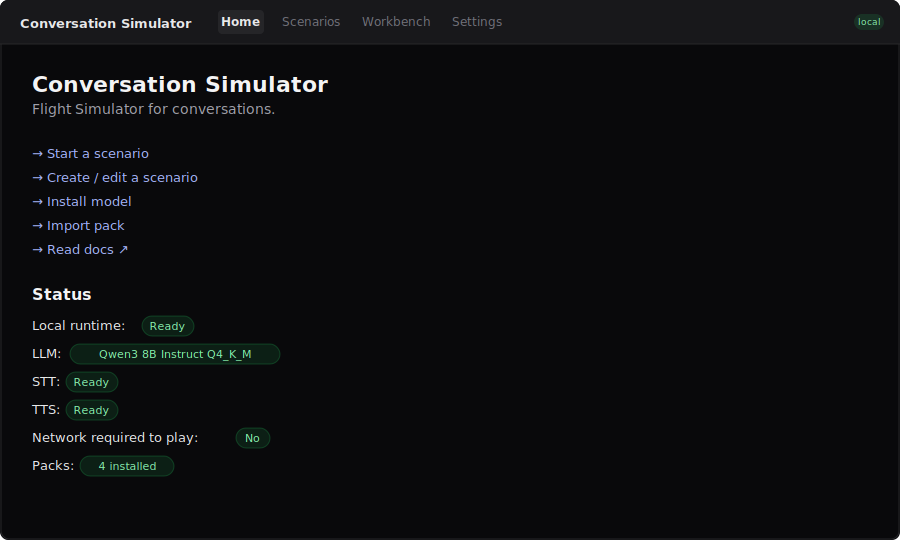
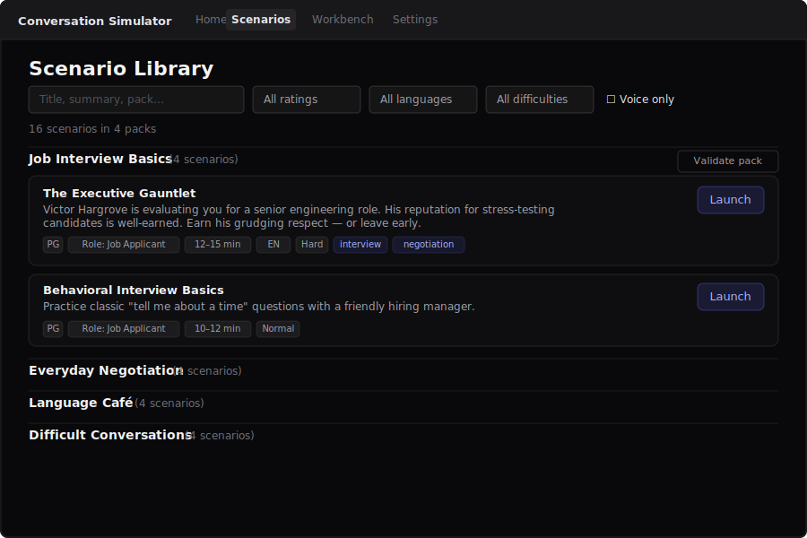
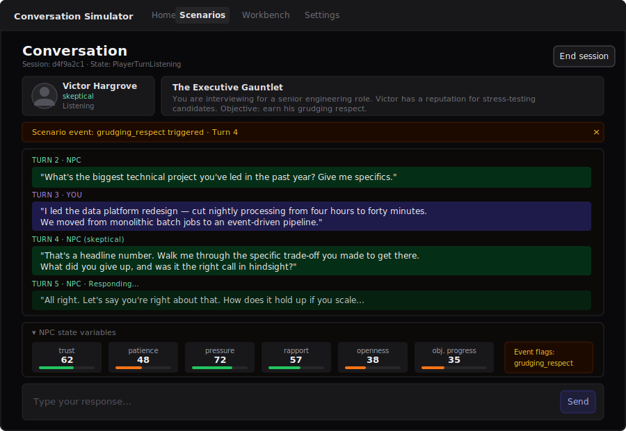
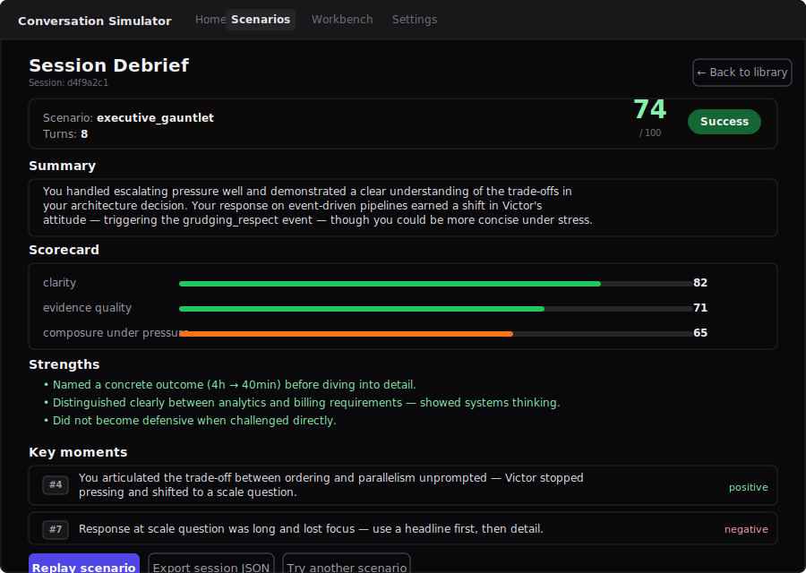
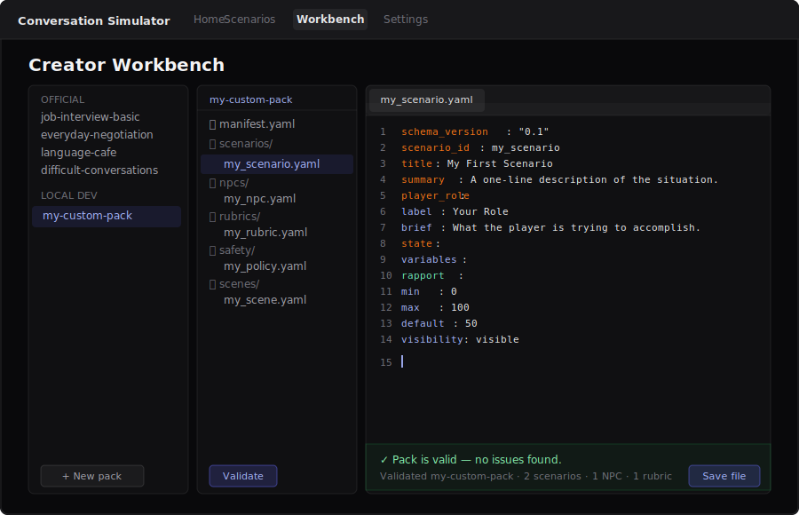
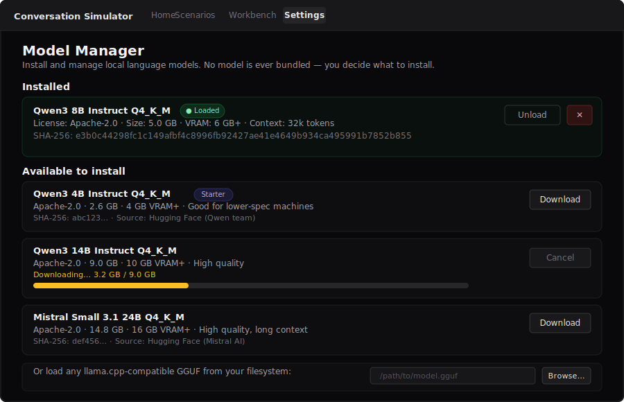

[](https://github.com/outrightmental/ConversationSimulator/actions/workflows/ci.yml)
[](https://github.com/outrightmental/ConversationSimulator/actions/workflows/release.yml)

<!-- SPDX-License-Identifier: CC-BY-4.0 -->
# Conversation Simulator

> The simulator for conversations.

Practice interviews, negotiations, language, and difficult social situations with AI
NPCs — running **100% on your computer**, no account, no cloud, no telemetry.


<!-- Placeholder SVG — replace with an animated GIF or short video at Milestone 1 launch.
     Recording guide and replacement checklist: docs/screenshots.md -->

```
Scenario: The Executive Gauntlet  ·  Job Interview Basics pack
You:   "I led the data platform redesign — cut nightly processing from 4 hours to 40 minutes."
NPC:   "That's a headline number. Walk me through the specific trade-off you made
        to get there. What did you give up, and was it the right call in hindsight?"
State:  credibility +12  ·  pressure_level +1  ·  composure 65
```

---

## Screenshots

| Screen | What you see |
|--------|-------------|
| [](docs/assets/screenshots/01-home.svg) | **Home** — all services ready |
| [](docs/assets/screenshots/02-scenario-library.svg) | **Scenario Library** — browse and filter packs |
| [](docs/assets/screenshots/03-conversation.svg) | **Conversation** — live state meters and events |
| [](docs/assets/screenshots/04-debrief.svg) | **Debrief** — score, strengths, turning points |
| [](docs/assets/screenshots/05-creator-workbench.svg) | **Creator Workbench** — YAML scenario editor |
| [](docs/assets/screenshots/06-model-manager.svg) | **Model Manager** — install and manage local models |

> Screenshots are SVG placeholders matching the current UI. They will be replaced with real
> recordings at Milestone 1 launch. See [docs/screenshots.md](docs/screenshots.md) for the
> replacement checklist and alt-text for each image.

---

## Quickstart

```bash
git clone https://github.com/outrightmental/ConversationSimulator
cd ConversationSimulator
./scripts/setup.sh     # check env, install packages, create ~/.convsim/
./scripts/dev.sh       # start all services
```

Then open **http://127.0.0.1:7354** in your browser.

**Windows:** use `scripts\setup.ps1` and `scripts\dev.ps1` instead.

On first launch you will be prompted to download a local model. The recommended
starter is **Qwen3 4B Instruct Q4\_K\_M** (~2.5 GB, Apache-2.0). No model is
bundled — you decide what to install and when.

> Full install guide: [docs/install.md](docs/install.md) &nbsp;·&nbsp;
> Troubleshooting: [docs/troubleshooting.md](docs/troubleshooting.md)

---

## Your first scenario

1. Complete the quickstart above.
2. In the browser, pick **Job Interview Basics → The Executive Gauntlet**.
3. Read the player brief, then start typing.
4. When the conversation ends, open the debrief — scores, turning points, and
   coaching notes are all generated locally.
5. Adjust difficulty or edit the scenario YAML and run it again.

---

## Starter scenario packs

| Pack | Scenarios |
| ---- | --------- |
| **Job Interview Basics** | Behavioral, hostile executive, blue-collar trade, stretch role |
| **Everyday Negotiation** | Used car, apartment lease, freelance scope, customer service refund |
| **Language Café** | Spanish coffee shop, French hotel check-in, Japanese convenience store, English small talk |
| **Difficult Conversations** | Coworker feedback, missed-deadline apology, boundary with a friend, ask for a raise |

All official packs are CC BY 4.0. Fork them, remix them, or create your own from scratch.

---

## Building a scenario pack

A pack is a folder of YAML files — no code, no build step, no compilation.

```
packs/
  my-pack/
    manifest.yaml          # pack id, title, author, content rating
    scenarios/
      my_scenario.yaml     # opening line, goals, state variables, events
    npcs/
      my_npc.yaml          # persona, tone, backstory, goals
    rubrics/
      my_rubric.yaml       # scoring dimensions and weights for the debrief
    safety/
      my_policy.yaml       # content categories and per-category actions
    scenes/
      my_scene.yaml        # visual and atmospheric context
```

The fastest way to build a pack is the **Creator Workbench** (in the app
navigation). Copy an official pack, edit the YAML files, validate with one
click, quick-test in the browser, and export a shareable `.zip` — all
without leaving the browser.

**New to pack authoring?** `packs/sample/hello-conversation/` is a
minimal one-scenario sample pack (CC0-1.0, public domain) with every
required file type and inline comments explaining each field. Copy it into
`packs/local-dev/` and start editing — or import its zip in the Creator
Workbench.

Minimal `scenarios/my_scenario.yaml`:

```yaml
schema_version: "0.1"
scenario_id: my_scenario
title: My First Scenario
summary: A one-line description of the situation the player faces.
player_role:
  label: Your Role
  brief: What the player is trying to accomplish in this conversation.
npc:
  ref: ../npcs/my_npc.yaml
rubric:
  ref: ../rubrics/my_rubric.yaml
duration:
  max_turns: 12
opening:
  npc_says: "Let's begin."
goals:
  player_visible:
    - "Reach a clear agreement without giving up your core need"
state:
  variables:
    rapport:
      min: 0
      max: 100
      default: 50
      visibility: visible
      max_delta_per_turn: 15
```

Add events, endings, difficulty modifiers, and extra rubric dimensions as you go.
The JSON Schema in `schemas/` validates everything at import time.

> Sample pack: [packs/sample/hello-conversation/](packs/sample/hello-conversation/) &nbsp;·&nbsp;
> Creator workbench tutorial: [docs/scenario-authoring.md](docs/scenario-authoring.md) &nbsp;·&nbsp;
> Pack validation: [docs/pack-validation.md](docs/pack-validation.md) &nbsp;·&nbsp;
> Official quality bar: [docs/official-pack-quality-bar.md](docs/official-pack-quality-bar.md)

---

## Local-first promise

> Conversation Simulator does not send your conversations, audio, prompts,
> transcripts, or model outputs to any server during play.

| What | Where it runs |
| ---- | ------------- |
| LLM inference | Local model via llama.cpp — stays on your machine |
| Speech-to-text | whisper.cpp — local, no audio uploads |
| Text-to-speech | Kokoro / sherpa-onnx — local, TTS audio cached on disk |
| Transcripts | SQLite at `~/.convsim/db/` — never uploaded |
| Telemetry | None — `telemetry_enabled` defaults off and the MVP ships no telemetry subsystem |
| Model downloads | Only when you explicitly request them; license shown before every download |

All services bind to `127.0.0.1`. Nothing is reachable from other machines by default.

Verify the offline guarantee at any time:

```bash
npx convsim offline-smoke-test packs/official/job-interview-basic
```

The command runs a scripted conversation with a fake runtime and confirms no
outbound TCP connection was made. It exits nonzero with an actionable error if
any subsystem attempts to reach an external host.

> Full data policy: [docs/privacy.md](docs/privacy.md) &nbsp;·&nbsp;
> Network security: [docs/network-security.md](docs/network-security.md)

---

## Architecture

Five services, all on localhost. The browser never talks to the internet.

```
┌──────────────────────────────────────────────────────────────┐
│                        Your machine                          │
│                                                              │
│  Browser (React / Vite)                                      │
│  convsim-ui  :7354                                           │
│       │  HTTP REST + WebSocket (localhost only)              │
│       ▼                                                      │
│  convsim-core  :7355  (Python / FastAPI)                     │
│       │                   SQLite  ~/.convsim/db/             │
│   ┌───┼──────────┐                                           │
│   ▼   ▼          ▼                                           │
│  :7356 :7357   :7358                                         │
│  LLM   STT     TTS                                           │
│ llama  whisper Kokoro / sherpa-onnx                          │
└──────────────────────────────────────────────────────────────┘
```

| Service | Port | Responsibility |
| ------- | ---- | -------------- |
| convsim-ui | 7354 | Browser UI (Vite dev server) |
| convsim-core | 7355 | Scenario engine, REST API, WebSocket |
| convsim-llm | 7356 | Local LLM (llama-server) |
| convsim-stt | 7357 | Speech-to-text (whisper.cpp) |
| convsim-tts | 7358 | Text-to-speech (Kokoro / sherpa-onnx) |

> Architecture deep-dive: [docs/architecture.md](docs/architecture.md) &nbsp;·&nbsp;
> Runtime adapters: [docs/runtime-adapters.md](docs/runtime-adapters.md)

---

## Model requirements

No model is bundled. The app shows license information and size before each download.

| Model | Size | VRAM | License | Role |
| ----- | ---- | ---- | ------- | ---- |
| Qwen3 4B Instruct Q4\_K\_M | 2.5 GB | 4 GB+ | Apache-2.0 | Starter (lower-spec machines) |
| Qwen3 8B Instruct Q4\_K\_M | 5.0 GB | 6 GB+ | Apache-2.0 | Standard (recommended for most) |
| Qwen3 14B Instruct Q4\_K\_M | 9.0 GB | 10 GB+ | Apache-2.0 | High quality |
| Mistral Small 3.1 24B Q4\_K\_M | 14.3 GB | 16 GB+ | Apache-2.0 | High quality, long context |

You can also load any llama.cpp-compatible GGUF file from your own filesystem.
The full model registry with checksums is in `model-registry/registry.yaml`.

> Local models guide: [docs/local-models.md](docs/local-models.md)

---

## Safety

Every session runs through a layered safety system before and after the model is called.

- Two categories are **global and cannot be disabled by any pack**: content
  involving minors in a romantic or sexual context always stops the session;
  self-harm crisis language always stops the session and surfaces real crisis resources.
- Input is checked deterministically before the NPC runtime is invoked.
- Packs are **declarative YAML only** — no executable code. The validator blocks
  scripts, binary files, symlink attacks, and prompt-injection patterns at import time.
- Community packs can tighten safety rules for their scenario; they cannot weaken
  the global non-overridable rules.
- Content cap: the platform supports G, PG, and PG-13 ratings. Nothing above PG-13
  is permitted in any pack.

> Full safety policy: [docs/safety-policy.md](docs/safety-policy.md)

---

## Roadmap

| Milestone | Goal | Status |
| --------- | ---- | ------ |
| 0 | Monorepo skeleton, dev setup, official scenario packs | Complete |
| 1 | Text-only local simulator (browser UI + Python backend + local LLM) | In progress |
| 2 | Scenario pack system (import, validate, browse community packs) | Planned |
| 3 | Local voice input (Whisper speech-to-text) | Planned |
| 4 | Local voice output (TTS with Kokoro / sherpa-onnx) | Planned |
| 5 | Polished playable alpha | Planned |

**[ROADMAP.md](ROADMAP.md)** — MVP acceptance criteria, build order, what is
deliberately out of scope, and links to the acceptance criteria and docs.

> [GitHub Milestones](https://github.com/outrightmental/ConversationSimulator/milestones) &nbsp;·&nbsp;
> [Full specification](docs/SPEC.md) &nbsp;·&nbsp;
> [Post-alpha issues](docs/post-alpha-issues.md)

### Steam release

The project is being prepared for a free, Outright Mental-sponsored Steam release.
The Steam edition makes the same local-first guarantee as the open-source build.

| Document | Purpose |
|----------|---------|
| [docs/STEAM_ROADMAP.md](docs/STEAM_ROADMAP.md) | Release principles and release train (Stages 1–5) |
| [publishing/STEAM_STORE_AND_OPERATIONS.md](publishing/STEAM_STORE_AND_OPERATIONS.md) | Store page operations, launch runbook, support triage |
| [publishing/STEAM_PUBLISHING_AND_DEPLOYMENT.md](publishing/STEAM_PUBLISHING_AND_DEPLOYMENT.md) | SteamPipe concepts, CI deploy, manual upload, branch promotion, troubleshooting |
| [docs/STEAM_INTEGRATION.md](docs/STEAM_INTEGRATION.md) | Steam API bridge, Steam Cloud exclusions, achievements, stats, rich presence |
| [publishing/MACOS_SIGNING_AND_NOTARIZATION.md](publishing/MACOS_SIGNING_AND_NOTARIZATION.md) | macOS Apple Developer ID signing and notarisation |
| [publishing/WINDOWS_CODE_SIGNING.md](publishing/WINDOWS_CODE_SIGNING.md) | Windows Authenticode signing |

---

## Contributing

All contributions are welcome — new scenario packs, bug fixes, documentation
improvements, or new runtime adapters.

> [CONTRIBUTING.md](CONTRIBUTING.md) &nbsp;·&nbsp;
> [CODE\_OF\_CONDUCT.md](CODE_OF_CONDUCT.md) &nbsp;·&nbsp;
> [SECURITY.md](SECURITY.md) &nbsp;·&nbsp;
> [RELEASE\_NOTES.md](RELEASE_NOTES.md)

---

## Repository layout

```
apps/
  web/             React / TypeScript browser UI
  desktop/         Tauri desktop wrapper (future milestone)

packages/
  ui/              Shared UI component library
  scenario-schema/ TypeScript types for scenario packs
  shared-types/    Shared TypeScript types across apps and services

services/
  convsim-core/    Python / FastAPI — scenario engine, REST API, WebSocket

runtimes/
  llama_cpp/       llama.cpp integration and binary management
  whisper_cpp/     whisper.cpp speech-to-text integration

packs/
  official/        First-party scenario packs (CC BY 4.0)
    job-interview-basic/
    everyday-negotiation/
    language-cafe/
    difficult-conversations/

schemas/           JSON Schema definitions for packs, scenarios, NPCs, rubrics
model-registry/    Curated registry of supported local models with checksums
docs/              Documentation (CC BY 4.0)
scripts/           Developer setup and launch scripts
```

---

## Licensing

| Content | License |
| ------- | ------- |
| Application code | Apache-2.0 |
| Official scenario packs | CC BY 4.0 |
| Documentation | CC BY 4.0 |
| Placeholder assets | CC0-1.0 |
| Model weights | Not bundled — user-installed with full license disclosure |

`LICENSE` contains the full Apache-2.0 text.  
`NOTICE` lists copyright notices and per-artifact license details.
